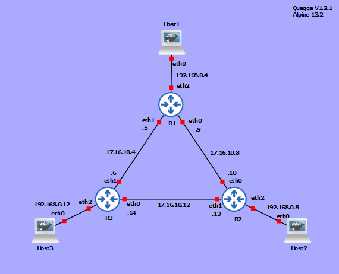

# docker-quagga

Dockerfile with Alpine Linux and Quagga Version 1.2.1 for GNS3.

Docker Hub: fknorre/quagga:1.2.1-alpine

## Usage

Run
```bash
docker run --rm -t -d --name quagga fknorre/quagga:1.2.1-alpine
```

Shell
```bash
docker exec -it quagga sh
```

Run telnet
```bash
telnet localhost 2602
```

## Re-/Build


Re-/Build:

```bash
docker build --tag fknorre/quagga:1.2.1-alpine .
```

## Example

### RIPv2



### OSPF
